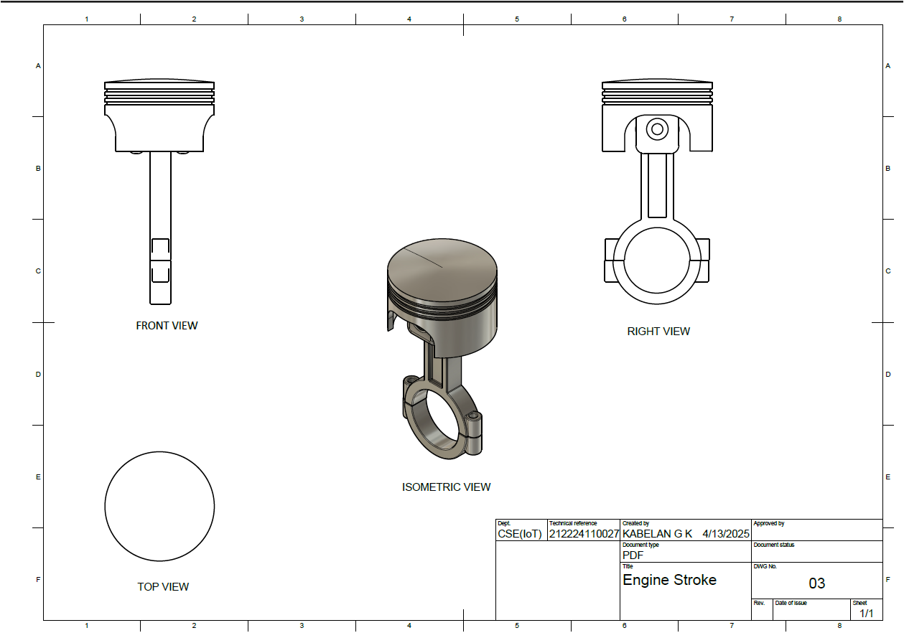

# Engine Piston Assembly
## Date: 07-04-2025

### DEVELOPED BY : **KABELAN G K - 212224110027**

## AIM
To create a 3D model of an engine piston assembly using Autodesk Fusion 360.

## REQUIREMENTS
1. Autodesk Fusion 360
2. Windows 10
3. 16 GB of RAM (Integrated graphics recommend 1 GB or more)
4. 2.5 Mbps or faster download; 500 Kbps or faster upload

## PROCEDURE

### STEP-1: Start a New Design
   1. Open Autodesk Fusion 360.
   2. Create a New Design file.

### STEP-2: Model the Piston
   1. Select **Sketch > Create Sketch** on the Front Plane.
   2. Sketch the piston profile using the **Line** and **Arc** tools.
   3. Close the profile carefully.
   4. Use **Create > Revolve** to revolve the profile 360 degrees around the centerline.

### STEP-3: Add Piston Details
   1. Sketch and **Cut** grooves for piston rings on the outer surface.
   2. Use the **Fillet** tool to round necessary edges.

### STEP-4: Model the Connecting Rod
   1. Start a new **Sketch** on the side plane.
   2. Sketch the profile of the connecting rod with two circular ends (for piston pin and crankshaft).
   3. Extrude the profile to create a solid rod.
   4. Cut internal holes for the pins.

### STEP-5: Model the Piston Pin
   1. Create a new **Sketch** on the appropriate plane.
   2. Sketch a simple **Circle** for the pin profile.
   3. Extrude to the required length.

### STEP-6: Assemble Components
   1. Move to **Assemble > New Component** for each part (Piston, Connecting Rod, Piston Pin).
   2. Use **Assemble > Joint** tool to align and connect:
      - Piston Pin with Piston.
      - Connecting Rod with Piston Pin.
   3. Ensure correct movement freedom where necessary.

### STEP-7: Apply Materials
   1. Open **Modify > Appearance**.
   2. Assign materials:
      - Metal (e.g., Steel or Aluminum) for the piston.
      - Strong alloy for the connecting rod.
      - Hardened steel for the piston pin.

### STEP-8: Save the Assembly
   Save the completed piston assembly.

## INPUT

## OUTPUT

### ISOMETRIC VIEW

### ENGINE STROKE

### PISTON

### CONNECTING ROD

### ASSEMBLER

## RESULT
Thus, the 3D model of the Engine Piston Assembly is created successfully using Fusion 360(All files are atteched).
